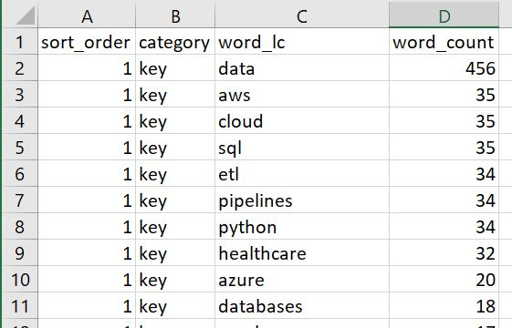
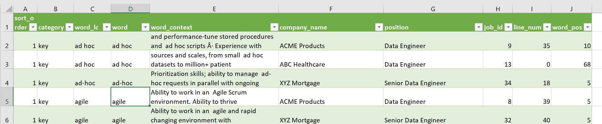

# Overview 
### This Python code is designed to help create a universal resume... though it could be adapted for other purposes.  Resumes and job descriptions often pose special problems with conflicts between 'words' you need to find and characters you need to ignore.  For example, C++, T-SQL, and C# are programming languages but characters like +, -, and # need to be removed before other words can be matched.  That is one of the problems this code solves.  It also handles looking for single character 'words', e.g., R for the R programming language.

### The idea is to create a few word category text files with a file name format of words-[category].txt and use those to match against the words in a bunch of job descriptions.  You will still need to manually create a universal resume but it is dramatically easier when you have a list with counts of the most commonly used words in the job descriptions.

### NOTE: Each word (or character string really) needs to be put on its own line in the words-[category].txt files.  By doing that there is no need to escape any characters and it makes it easier to copy and paste lists of words from most applications.

### So a file named words-softskills.txt would be the list of softskills you want to search for and the analysis will tell you how many times those words are used.  The matching job description words will be assigned to the softskills category.
  
### You are required to have a words-ignore.txt file though you could leave it empty if you want.  I provided a default list of words in that file which I chose to ignore... adjust it as you see fit. I included empty files for words-softskills.txt and words-key.txt because I believe you will need at least those two to perform a meaningful analysis.  If you want more categories, add more words-[category].txt files.

### NOTE: You cannot have the same word (or sequence of characters) on a line in more than one words-[category].txt file.  If you do, an error will be thrown telling you the word that was repeated and the files it can be found in.  You would need to fix it and choose one file for the word before proceeding.  It is beyond the scope (and need) of this project to assign multiple categories to the same word.

# Instructions for Use  
### You need the following data for the code to work.  

### 1. Put the text of each job description you are interested in its own text (*.txt) file using either UTF-8 or ASCII encoding.  Use the following file name format: [Company Name] - [Job Title].txt

### Example job description file name

```
Acme Products Company - Data Engineer.txt
```

### Using hyperlinks to retrieve job descriptions was considered but there are so many different job sites and formats it was not feasible for this project.

### 2. Place all the job description files in the same folder.  The code will not traverse subdirectories at this time.

### 3. Adjust the words-[category].txt files as described in the Overview section however you would like.  Leave them in the same folder as the main.py file.

### 4. In the main.py file itself set the job_desc_folder variable to the folder where the job decscription files are.

### 5. If you used more than the 'words-key.txt' and 'words-softskills.txt' files for your categories, adjust the word_category_files list variable as needed.  The words-[category].txt files are purposely not discovered automatically because the order in the word_category_files list sets the priority of their sorting in the results.

# That's it.  Now run the main.py code.  It will analyze the files and produce 2 CSV file reports in the same folder as main.py.
Report file names for job description analyses

```
word_counts.csv
df_job_desc_words.csv
```

### First few lines of a word_counts.csv report



### First few lines of a df_job_desc_words report

